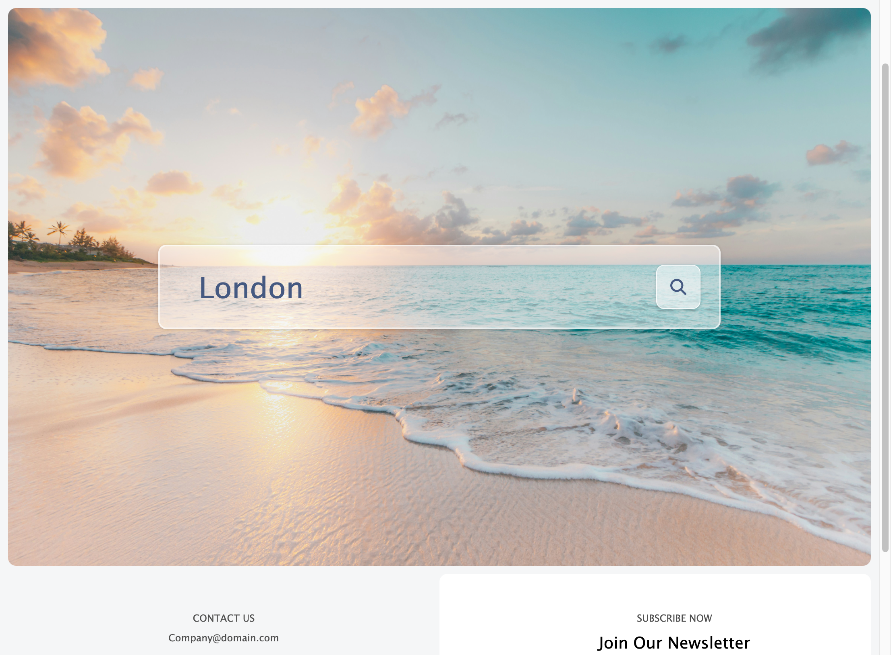
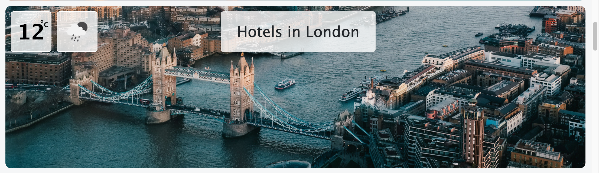
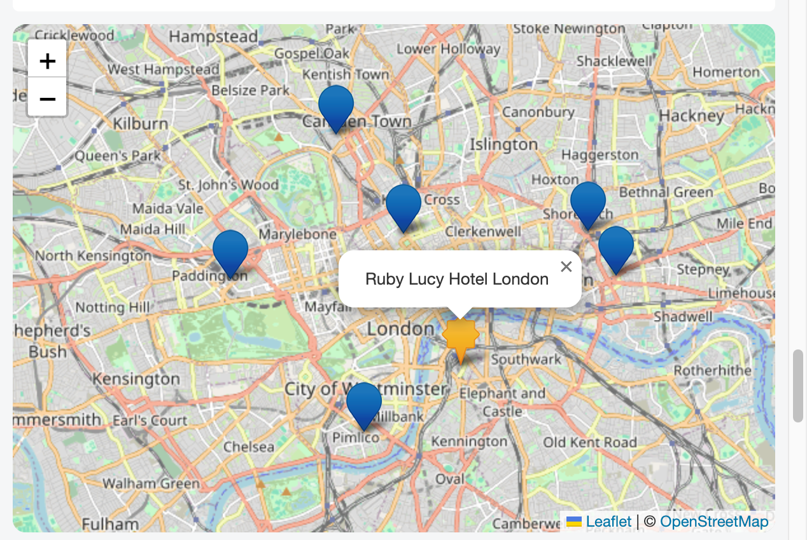
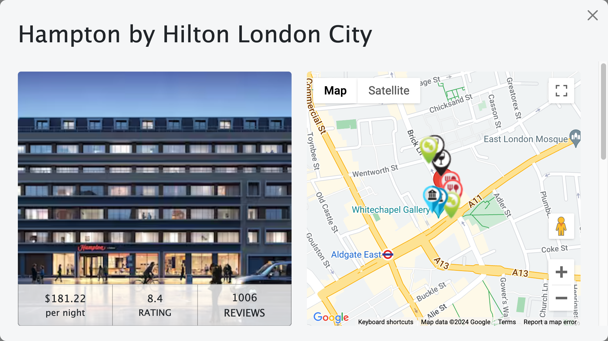
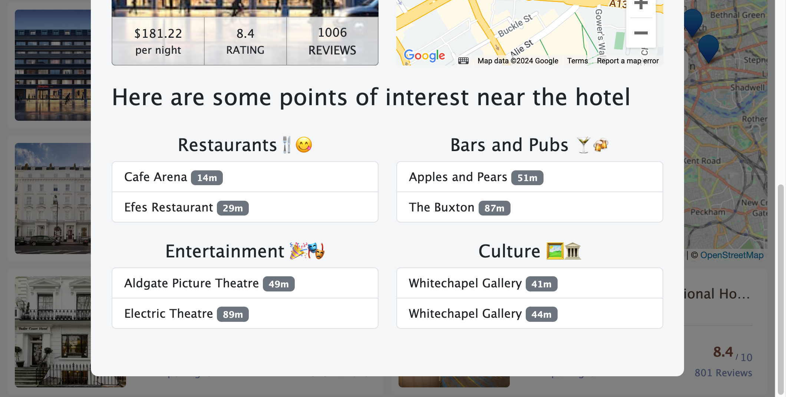

# Travel App

## Description 
We proudly present our innovative Travel App, crafted to streamline a user's holiday planning experience. 
This user-friendly application serves as the ultimate guide, offering a comprehensive overview of highly recommended hotels at the user's chosen destination. Beyond this, it seamlessly connects the user to local restaurants, bars, pubs, entertainment and cultural spaces and activities conveniently situated within close proximity to their selected hotel.
We have additionally incorporated a map feature for effortless navigation to these spaces. 

Our dedication to a streamlined and simplified user experience led us to develop this as a one-page application, ensuring intuitive usability and a smooth customer journey.

## Travel App Usage/Visuals

### Search Feature:

### Information Display:

### Hotel Results:  

### Map Display:

### Modal Overview:

### Locations Near Hotel:

## Support
For support with App Features email: Company@domain.com

## Roadmap
- Itinerary Planner
- Direct booking options
- Account creation
- Enable newsletter functionality
- Promotions and offers direct to users

## Authors and Acknowledgment
Thank you to all collaborators on this Project

#### Wireframe/design & Navbar
- Haydawn Wilson

#### API search, implementation and functionality
- Adam Debski
- Sophie Ainsworth
- James Stott

#### Search function/jumbotron
- Jack Emmonds

#### Hotel card idea and functionality
- Jack Emmonds
- Sophie Ainsworth
- Haydawn Wilson

#### Footer & UX
- James Stott

#### Modal
- Adam Debski
- James Stott

## References

### APIs Used
- Hotel Search and Card Generation: [Rapid API](rapidapi.com/)
- Weather on Collapsed Jumbotron: [Open Weather Map API](https://openweathermap.org)
- Images: [Pexels API](https://www.pexels.com/api/) [Unsplash](https://unsplash.com/developers)
- Map (below hotel cards): [LeafletJS API](https://leafletjs.com)
- Modal Nearby Locations: [OpenTripMap API](https://dev.opentripmap.org/docs)
- Modal Map: [Google Maps API](https://developers.google.com/maps/documentation/javascript)
- Local Storage: [localStorage](https://developer.mozilla.org/en-US/docs/Web/API/Storage)

### Libraries Used
- [Bootstrap](https://getbootstrap.com/)
- [jQuery](https://jquery.com/)

## Deployed Project 
[Travel App](https://adam-deb.github.io/project-1/)

## License

This project is licensed under the MIT License

©2023. Group-2-p1. All Rights Reserved.
